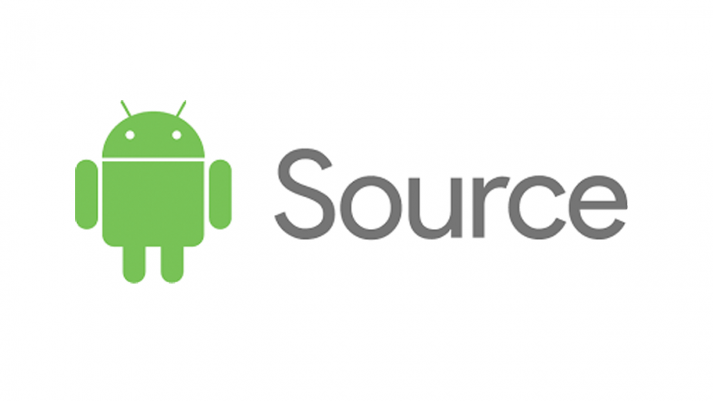

#  

* **Hazırlayan**      : Gökhan ÖZTÜRK, [GokhanOzturk@AndroidEdu.IO](mailto:GokhanOzturk@AndroidEdu.IO)
* **Katkı Sunanlar**  : Ahmet Rıfat Can Gür, [CanGur@AndroidEdu.IO](mailto:CanGur@AndroidEdu.IO)

* Yardıma ihtiyacın mı var?
    * 
        * Odada aktif olarak kimse bulunmasa bile, siz sorunuzu sorun. Odaya bir sonraki girişimizde, sorunuzu görebiliriz ve cevaplandırabiliriz.
    * Açık Kaynak dokümanı lütfen inceleyiniz; öneri ve düzeltmeler için lütfen "issue" açınız -> [issues](https://github.com/AndroidEduIO/AndroidSources/issues)

## Açık Kaynak Dünyasına Bakış Açımız

Bu dokümanı hazırlamaktaki temel amacımız, Android Uygulama Geliştirme alanında çalışan tüm bireylerin takip edebilecekleri -kaliteli- kaynakların bir listesini çıkarmak ve herkes için bu kaynakları ulaşılabilir kılmaya çalışmak. Ortak bir bilgi seviyesi yakalayarak özellikle gençlerin bu alanda çalışabilmesini ve araştırabilmesini sağlamak.

## Git ve GitHub Kaynakları

* **Demirbaş Referanslar**
    * [Güncellenecek](http://googlecom)
    
* **Kütüphaneler**
    * [Güncellenecek](http://googlecom)
    
* **RSS Kayıtları**
    * [Güncellenecek](http://googlecom)
    
* **Videolar**
    * [Güncellenecek](http://googlecom)
    
* **Slack Kanalları**
    * [Güncellenecek](http://googlecom)
    
* **PodCast'ler**
    * [Güncellenecek](http://googlecom)

* **Facebook Sayfa ve Grupları**
    * [Güncellenecek](http://googlecom)
    
* **Mutlaka Okunması Gereken Kaynaklar**
    * [Güncellenecek](http://googlecom)

* **Bloglar**
    * [Güncellenecek](http://googlecom)
    
* **Kişiler**
    * [Güncellenecek](http://googlecom)
    
* **Etkinlikler**
    * [Güncellenecek](http://googlecom)

## Kotlin Kaynakları

* **Demirbaş Referanslar**
    * [Güncellenecek](http://googlecom)
    
* **Kütüphaneler**
    * [Güncellenecek](http://googlecom)
    
* **RSS Kayıtları**
    * [Kotlin Weekly](http://kotlinweekly.net/)
    
* **Videolar**
    * [KotlinConf 2017](https://www.youtube.com/playlist?list=PLQ176FUIyIUY6UK1cgVsbdPYA3X5WLam5)
    
* **Slack Kanalları**
    * [KotlinLang](https://kotlinlang.slack.com/)
    
* **PodCast'ler**
    * [Güncellenecek](http://googlecom)
    
* **Facebook Sayfa ve Grupları**
    * [Güncellenecek](http://googlecom)
    
* **Mutlaka Okunması Gereken Kaynaklar**
    * [Güncellenecek](http://googlecom)

* **Bloglar**
    * [Güncellenecek](http://googlecom)
    
* **Kişiler**
    * [Google Developers Experts - Kotlin](https://developers.google.com/experts/all/technology/kotlin)
    
* **Etkinlikler**
    * [Güncellenecek](http://googlecom)
    
## Android Kaynakları

* **Demirbaş Referanslar**
    * [Developer.Android](https://developer.android.com/index.html)
    
* **Kütüphaneler**
    * [Lib4dev](http://www.lib4dev.com/topics/kotlin?p=1&s=)
    
* **RSS Kayıtları**
    * [Android Weekly](https://androidweekly.net/)
    
* **Videolar**
    * [AndroidDay'17](https://www.youtube.com/playlist?list=PLSV3VvYZSJP1vo8PZYti9LHoWFUz5K7_4)
    * [droidcon SF 2017](https://www.youtube.com/playlist?list=PLYioXtkIMlS8wsv0jaA3ArxGtZ0RMLZR2)
    
* **Slack Kanalları**
    * [GDG-Istanbul](https://gdgistanbul.slack.com/)
    * [AndroidChat](https://androidchat.slack.com/)
    * [AndroidChat](https://android-united.slack.com/)
    
* **PodCast'ler**
    * [Güncellenecek](http://googlecom)
    
* **Facebook Sayfa ve Grupları**
    * [Güncellenecek](http://googlecom)
    
* **Mutlaka Okunması Gereken Kaynaklar**
    * [Güncellenecek](http://googlecom)
    
* **Bloglar**
    * [Retrofit, Glide, Picasso, Gson (Network işlemleri)](https://futurestud.io/tutorials)
    
* **Kişiler**
    * [Google Developers Experts - Android](https://developers.google.com/experts/all/technology/android)
    
* **Etkinlikler**
    * [Android & iOS 2018 Etkinlik Takvimi](https://bugfender.com/conferences/)
    
## Flutter & Cross-Platform Kaynakları

* **Demirbaş Referanslar**
    * [Güncellenecek](http://googlecom)
    
* **Kütüphaneler**
    * [Güncellenecek](http://googlecom)
    
* **RSS Kayıtları**
    * [Flutter Weekly](https://flutterweekly.net/)
    
* **Videolar**
    * [Güncellenecek](http://googlecom)
    
* **Slack Kanalları**
    * [Güncellenecek](http://googlecom)
    
* **PodCast'ler**
    * [Güncellenecek](http://googlecom)
    
* **Facebook Sayfa ve Grupları**
    * [Güncellenecek](http://googlecom)
    
* **Mutlaka Okunması Gereken Kaynaklar**
    * [Güncellenecek](http://googlecom)
    
* **Bloglar**
    * [Güncellenecek](http://googlecom)
    
* **Kişiler**
    * [Google Developers Experts - Flutter](https://developers.google.com/experts/all/technology/flutter)
    * [Google Developers Experts - Dart](https://developers.google.com/experts/all/technology/dart)
    
* **Etkinlikler**
    * [Güncellenecek](http://googlecom)

## Genel Programlama Kaynakları

* **Demirbaş Referanslar**
    * [EveryProgrammerShouldKnow](https://github.com/mr-mig/every-programmer-should-know)
    
* **Kütüphaneler**
    * [Güncellenecek](http://googlecom)
    
* **RSS Kayıtları**
    * [Mobil Dünya](http://mobildunya.ahmet.ws/)
    * [Hackathonturkiye](https://hackathonturkiye.com)
    * [Academy.Realm.IO](https://academy.realm.io/section/android/)
    
* **Videolar**
    * [Güncellenecek](http://googlecom)
    
* **Slack Kanalları**
    * [İstanbul Coders](https://istanbulcoders.slack.com/)
    * [SoftwareCrafters](https://softwarecrafters.slack.com/)
    
* **PodCast'ler**
    * [Güncellenecek](http://googlecom)
    
* **Facebook Sayfa ve Grupları**
    * [Güncellenecek](http://googlecom)

* **Mutlaka Okunması Gereken Kaynaklar**
    * [Stackoverflow İncelenerek Oluşturulmuş En Çok Tavsiye Edilen Kitap Listesi](http://www.dev-books.com/book/discover?tag=android)
    * [Okumanız Gereken En Önemli Kitaplar Listesi](https://github.com/chhantyal/influential-cs-books)
    
* **Bloglar**
    * [Güncellenecek](http://googlecom)
    
* **Kişiler**
    * [Güncellenecek](http://googlecom)
    
* **Etkinlikler**
    * [Güncellenecek](http://googlecom)
    
## Design
   * [Panda Weekly](https://usepanda.com/newsletter.html)
    
## Plugin & Extension
   * [Google Chrome Extension - Panda](https://chrome.google.com/webstore/detail/panda-hacker-news-dribbbl/jhiocdmmaannaccoofjfmjpbfkogmnap)
   * [Google Chrome Extension - OctoTree](https://chrome.google.com/webstore/detail/octotree/bkhaagjahfmjljalopjnoealnfndnagc)
   * [Google Chrome Extension - Json Formatter](https://chrome.google.com/webstore/detail/json-formatter/bcjindcccaagfpapjjmafapmmgkkhgoa)
   * [Google Chrome Extension - Stack Notifier - StackOverFlow](https://chrome.google.com/webstore/detail/stacknotifier-stackoverfl/dkicpibgdednbmlclkbcehckpfficabn)
   * [Google Chrome Extension - Weava-Highlighter](https://chrome.google.com/webstore/detail/weava-highlighter-pdf-web/cbnaodkpfinfiipjblikofhlhlcickei)
   * [Google Chrome Extension - StackOverFlow-Code-Beauti](https://chrome.google.com/webstore/detail/stackoverflow-code-beauti/pljeafjjkkbacckkollfejkciddacmeb)

## Code Pratiği Yapılabilecek Siteler
   * [HackerRank](https://www.hackerrank.com/)
   * [CodinGame](https://www.codingame.com/start)
   * [CodeMentor](https://www.codementor.io/u/dashboard)
   * [HackerEarth](https://www.hackerearth.com/)
   * [TopCoders](https://www.topcoder.com/)
   * [CodeWars](https://www.codewars.com/)
   * [Exercism](http://www.exercism.io/)
   * [CodeFights](https://codefights.com/)
   * [InterviewBit](https://www.interviewbit.com/)

## Ücretsiz API'lar
   * [AppSight.IO](https://www.appsight.io/?os=android)
   * [Mashape](https://market.mashape.com/)
    
## Yardımcı Araçlar
   * [Güncellenecek](http://googlecom)

## Filmler ve Diziler
   * [Güncellenecek](http://googlecom)

## Kendimizi geliştirmemiz için lütfen Geri Bildirim (Feedback) vermekten çekinmeyiniz..
[GokhanOzturk@AndroidEduIO](mailto:GokhanOzturk@AndroidEdu.IO)
